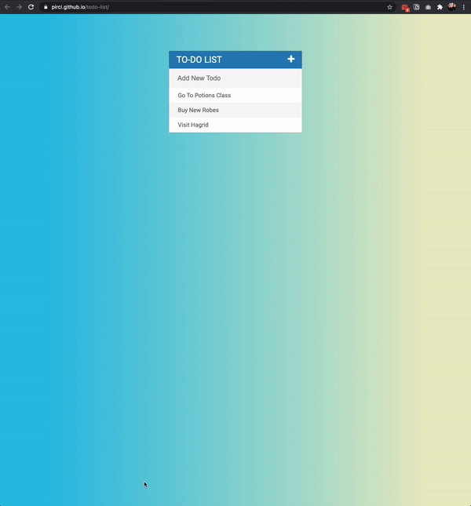

# Todo List Web App

> Todo list app created using javascript. New todo can be easily added to the list. Completed things to do can be removed with a single click.

## Live Demo

Preview:  https://pirci.github.io/todo-list/

## What I Learned:

- Applied and understanding JavaScript's "Conditional" Statements
- fadeOut function implemented
- Function document.getElementById() implemented
- Multiple types of CSS selectors

## Possible Improvements

- Could make the page layout more pleasing to the eye
- Formatting could be improved when viewing on certain devices/browsers

> Any type of suggestions/improvements to this repo are always welcome.
